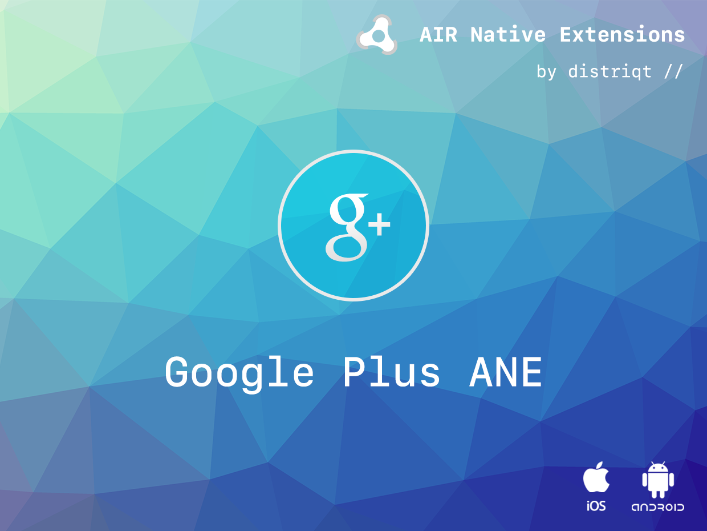

built by [distriqt //](https://airnativeextensions.com) 

# Google Plus

> 
> **Deprecated**: The Google+ sign in and people functionality has been deprecated.
> 
> Google has replaced most of the functionality here with the generic Google Identity API which is 
> implemented in the [Google Identity ANE](https://airnativeextensions.com/extension/com.distriqt.GoogleIdentity).
> 
> While this ANE will still be available please be aware that the sign in services will eventually stop working, 
> and we will wind down support and development on the ANE to coincide. 
> All existing customers can contact us for a free license transfer to the **Google Identity ANE**.
> 
> If you have any questions or concerns you can contact us at [airnativeextensions@distriqt.com](mailto:airnativeextensions@distriqt.com).
>

The [Google Plus](https://airnativeextensions.com/extension/com.distriqt.GooglePlus) extension 
gives you access to the Google+ API including, sign in, out and disconnect functionality along 
with the ability to share a post via the Google Share Dialog.

The simple API allows you to quickly integrate Google+ in your AIR application. Identical code 
base can be used across all platforms allowing you to concentrate on your application and not 
device specifics.

We provide complete guides to get you up and running with asset selection quickly and easily.

### Features

- User Sign in, out and disconnect;
- Access to the user profile information;
- Use the G+ Share dialog to post to the user stream;
- Access to the `idToken` for user authentication;
- Your code works across iOS and Android with no modifications;
- Sample project code and ASDocs reference

As with all our extensions you get access to a year of support and updates as we are continually 
improving and updating the extensions for OS updates and feature requests.

## Documentation

Latest documentation can be found in the [wiki](https://github.com/distriqt/ANE-GooglePlus/wiki)

More information here: 

[com.distriqt.GooglePlus](https://airnativeextensions.com/extension/com.distriqt.GooglePlus)

## License

You can purchase a license for using this extension:

[airnativeextensions.com](https://airnativeextensions.com/)

distriqt retains all copyright.

