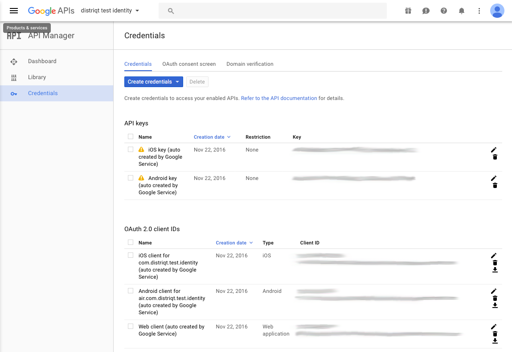

This shows you where to gather the information required for the Google Identity options you will use to initialise the extension.

# Client IDs

You should now go to the [Google Developers APIs Console](https://console.developers.google.com/apis)
select your project and retrieve the client IDs from the Credentials section.

You will need:

- OAuth 2.0 client IDs 
  - iOS client / client ID: `options.clientID_iOS`
  - Web client (Web application) / client ID (for Android): `options.clientID_Android`
    - *Optional: 'Client secret' if you require server authentication codes* This is generally not needed unless you have a very unusual use case.
